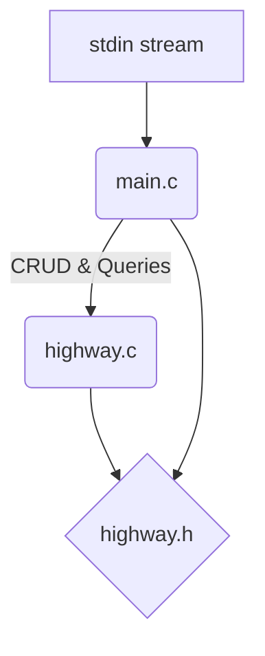

# Data Highway


Academic solo project for the Algorithms and Data Structures course at Politecnico di Milano (2022).
It implements a memory-constrained route planning engine in C, graded 30/30. The project focuses on algorithmic efficiency, custom memory management, and debugging tools (Valgrind, Cachegrind, GDB).

## Problem Description

The system models a highway as an ordered sequence of stations, identified by their kilometre marker. Each station has a parking lot with up to 512 vehicles, and each vehicle has a specific range (km it can travel).

Given a start and end station, the program must compute the route with the minimum number of vehicle swaps.
- **Constraint 1**: You must swap vehicles at every intermediate stop.
- **Constraint 2**: If multiple routes have the same number of stops, prioritize stops closest to the departure point.
- **Constraint 3**: Strict time and memory limits; input streams can be up to 50MB.

## Architecture

The original single-file academic submission was split into a modular structure:



| File | Role |
|---|---|
| [`src/highway.h`](src/highway.h) | Interface: `Station` struct, constants, and function prototypes. |
| [`src/highway.c`](src/highway.c) | Implementation: Binary search, CRUD operations, greedy pathfinding. |
| [`src/main.c`](src/main.c) | I/O: Command-loop dispatcher. |

## Algorithms & Complexity

To stay within the memory limits, a standard graph representation (like adjacency lists for Dijkstra or BFS) was avoided. Instead, the highway is kept as a 1-indexed, dynamically reallocated sorted array. 

Pathfinding relies on a greedy backward recursion strategy rather than a full graph traversal, significantly reducing memory overhead.

| Operation | Strategy | Time Complexity | Space |
|---|---|---|---|
| **Station Lookup** | Binary search on sorted array | `O(log n)` | `O(1)` |
| **Station Insertion**| Right-shift with `realloc` | `O(n)` | `O(1)` |
| **Station Deletion** | Left-shift with `realloc` | `O(n)` | `O(1)` |
| **Path Planning** | Greedy backward recursion | `O(n²)` worst-case | `O(n)` stack |

## Memory & Data Structures

- **`highway[]`**: A heap-allocated sorted array. Index 0 is a sentinel to simplify boundary checks in binary searches.
- **`parking[]`**: A fixed-size `calloc`'d array of 512 integers per station. The maximum range is cached locally (`max_range`) to make reachability checks `O(1)`.
- **`path[]`**: A statically allocated global buffer used during recursion to prevent heap fragmentation.

## Build & Test

A standard `Makefile` is provided.

```bash
cd src
make          # Optimised build (-O2)
make debug    # Debug build (-O0, AddressSanitizer, UBSanitizer)
```

The `test/` directory contains 111 input/output pairs and a bash test runner.

```bash
cd test
./run_tests.sh          # Run all 111 cases
./run_tests.sh 50 111   # Run specific cases
```

## Debugging Workflow

During development, GDB and Valgrind were used for logic and memory profiling. A typical debugging session looked like this:

```bash
make -C src debug
gdb src/highway
(gdb) break find_path_backward
(gdb) run < test/input/open_100.input.txt
(gdb) print *finish
(gdb) backtrace
```

*Note: Reference code used to practice with Valgrind/Cachegrind is kept in [`docs/ref/`](docs/ref/).*
